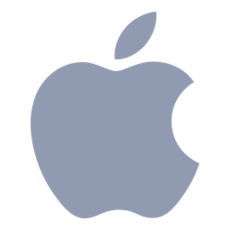

# surge-icons

| | | | | | |
| :---: | :---: | :---: | :---: | :---: | :---: |
|  `AdBlock` |  `Apple-v2` |  `Binance` |  `Bitget` |  `Blizzard-v2` |  `Claude` |
|  `Copilot` |  `Discord` |  `Disney` |  `Final` |  `Gemini` |  `Global` |
|  `Google` |  `Japan` |  `Media` |  `Microsoft` |  `Netflix` |  `OKX` |
|  `OpenAI` |  `Proxy` |  `Server` |  `Speedtest` |  `Steam` |  `Synology` |
|  `Telegram` |  `TikTok` |  `US` |  `Wargaming-v2` |  `WhatsApp` |  `YouTube` |
